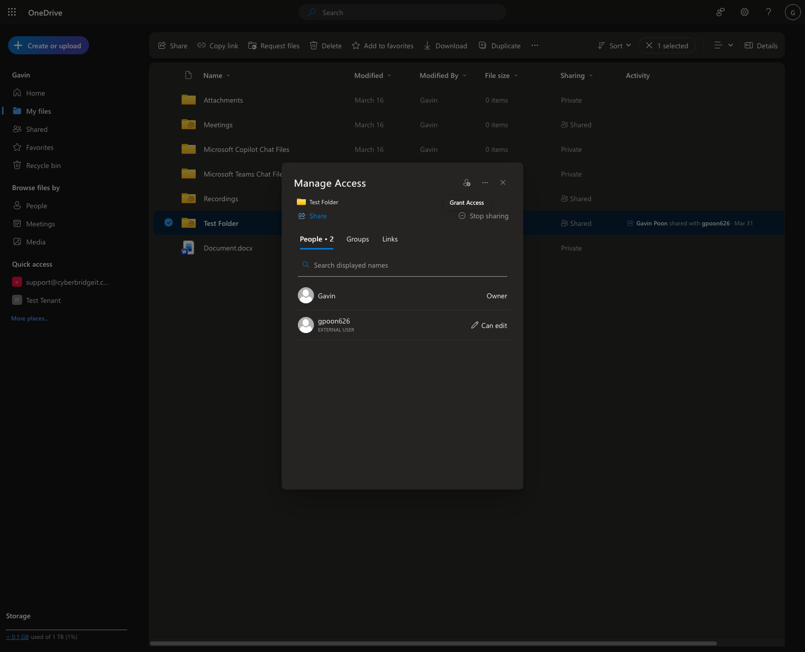
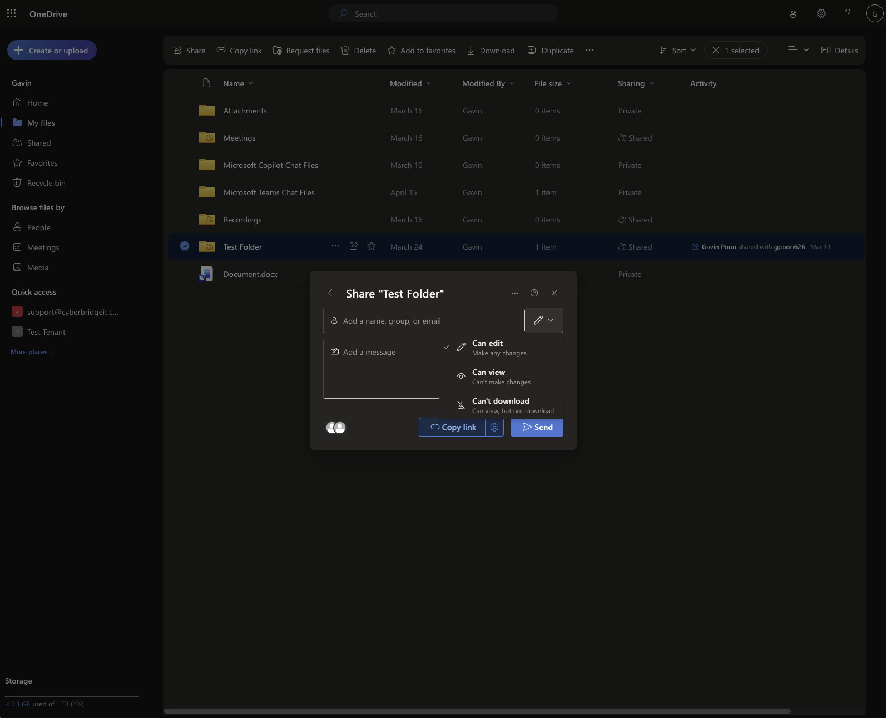
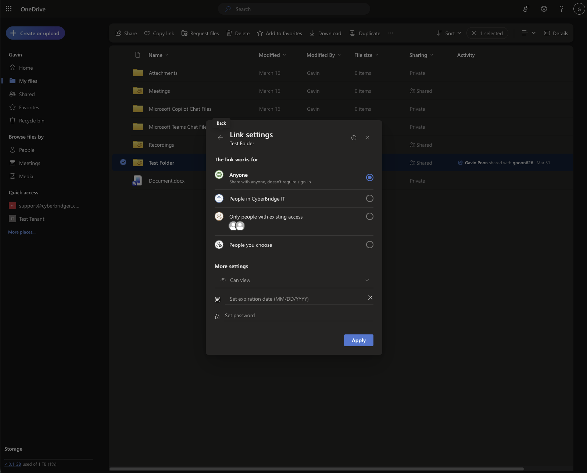
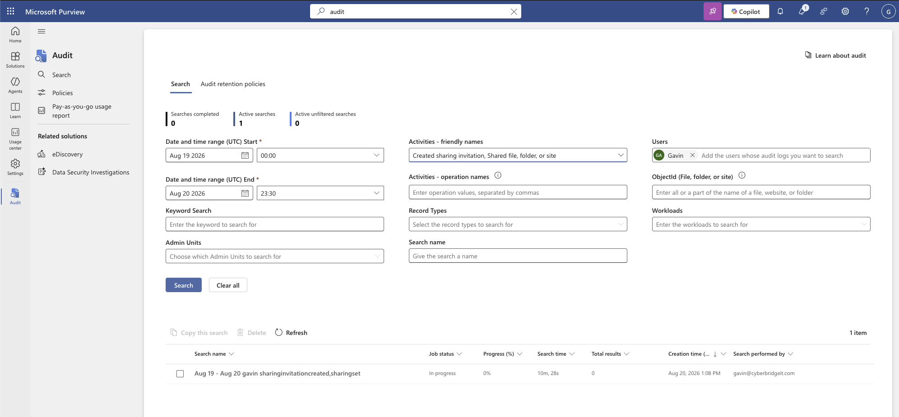
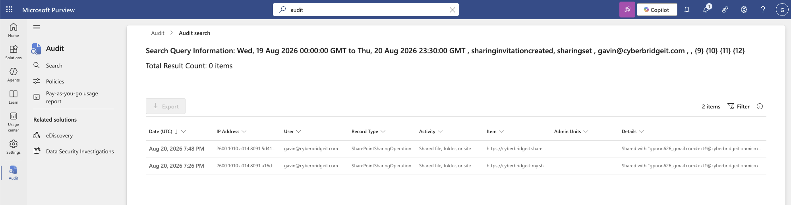
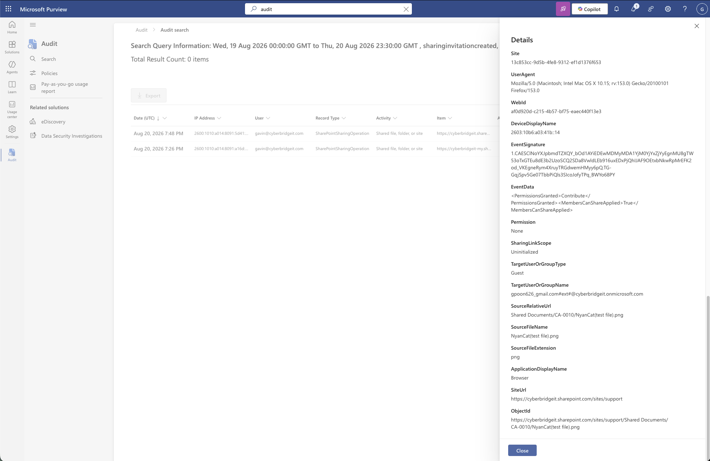
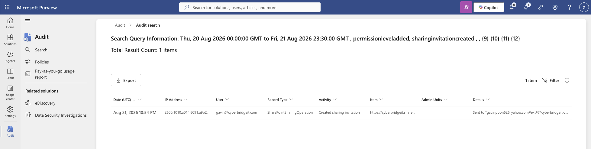
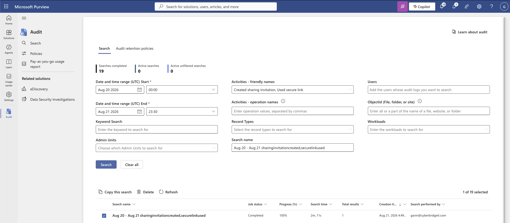

# External Sharing and Access Governance

> Status: Draft

## Scenario

A series of authorized Microsoft 365 lab exercises examined how SharePoint and OneDrive content could be shared outside the organization. The work included reviewing existing permissions, reducing unnecessary edit access, tracing external sharing through Microsoft Purview Audit, testing external re-sharing, and generating a tenant-wide sharing report.

## Objectives

- Review active sharing links and direct access assignments.
- Apply least privilege to an external recipient.
- Generate and investigate an external sharing event.
- Determine whether an external user could re-share content.
- Trace sharing activity through Microsoft Purview Audit.
- Review external sharing without limiting the search to one user.
- Understand audit-log ingestion delays and operation-name limitations.

## Environment

- Microsoft SharePoint Online
- Microsoft OneDrive
- Microsoft Purview Audit
- Dedicated organizational and external test accounts
- SharePoint sharing and permission controls

## Activities and Findings

### 1. Sharing-Link and Permission Review

A test folder was reviewed through **Manage access**. No active sharing links were present, but one external recipient had direct edit access.

Because the recipient only needed to view the content, the permission was changed from **Can edit** to **Can view**. This reduced the recipient’s ability to modify the folder’s contents and applied the principle of least privilege.

“Anyone with the link” sharing was also considered. Passwords and expiration dates can reduce risk, but anyone who obtains the link may still be able to access the content. For sensitive information, access limited to specific authenticated recipients provides stronger control.

### 2. External Sharing Investigation

A test document was uploaded to SharePoint and shared with a specific external account. A Microsoft Purview Audit search was then configured for the relevant time range, user, and sharing activities.

The resulting audit event identified:

- The user who initiated the share
- The external recipient
- The item that was shared
- The sharing activity
- The associated timestamp and event details

The audit search took approximately 13 minutes to complete. Matching activity became available while the search job was still processing, demonstrating that audit results may appear incrementally.

An empty or incomplete result immediately after starting a search should not be treated as proof that the activity did not occur. The search job and audit-data ingestion may still be processing.

### 3. External Re-Sharing Risk

A SharePoint folder was shared with an external test account using edit permissions. After signing in as the external recipient, another external share was initiated.

In this lab configuration, edit access allowed the collaboration scope to expand beyond the original recipient. Purview Audit recorded the sharing invitation and identified the item, initiating user, and new recipient.

This demonstrated why edit access creates more risk than view-only access. Depending on the organization’s sharing configuration, edit permissions may allow recipients to modify content or initiate additional sharing.

External permissions should therefore be based on business need, reviewed periodically, and reduced when broader collaboration rights are unnecessary.

### 4. Tenant-Wide Sharing Review

A Purview Audit search was performed without filtering to a specific user. The objective was to review external sharing activity across the available tenant data rather than investigating only one account.

The search returned a **Created sharing invitation** event, including the initiating user, external recipient, and shared item.

No **Used secure link** event appeared, even though the shared resource had been accessed externally. This showed that a user action and an audit operation name do not always map one-to-one.

The absence of a specific operation should not automatically be interpreted as proof that the action never occurred. Related file-access and sharing events may need to be correlated to reconstruct the full activity.

## Sharing-Risk Assessment

| Finding | Risk | Recommended control |
|---|---|---|
| External recipient had edit access | Content could be modified or re-shared | Reduce access to view-only when editing is unnecessary |
| “Anyone” links can be forwarded | Access may spread beyond the intended recipient | Prefer specific authenticated recipients |
| External re-sharing was possible | Collaboration scope could expand without direct owner action | Restrict external sharing and review permissions |
| Audit results were delayed | Investigators may initially see incomplete evidence | Allow for ingestion time and rerun consistent searches |
| Expected audit operation was absent | A single operation may not represent the complete action | Correlate related sharing and file-access events |
| Tenant-wide visibility was available | External sharing patterns could be reviewed across users | Use recurring governance and compliance reviews |

## Outcome

The exercises demonstrated how direct permissions, sharing links, recipient access levels, and external re-sharing can affect Microsoft 365 data exposure.

Microsoft Purview Audit provided an investigation trail showing who shared an item, what was shared, and which external recipient received access. The work also identified two important limitations: audit evidence may be delayed, and operation names may not correspond directly to the user action being investigated.

## Limitations

- All sharing activity was intentionally generated in an authorized lab.
- The investigation used a limited number of test users and files.
- Audit-search results were not real-time.
- Available audit events depended on the activities generated and the tenant’s logging behavior.
- The exercises did not evaluate every SharePoint tenant-level sharing control.

## Security Concepts Demonstrated

- Data-loss risk investigation
- External-sharing governance
- Least privilege
- SharePoint permission review
- Audit-log analysis
- Evidence correlation
- Access recertification
- Compliance reporting
- Microsoft Purview Audit
- Security-event timeline reconstruction

## Evidence

### External Access and Permission Review

The folder’s Manage Access panel showed that an external user had edit access. Because the recipient only needed to view the content, this access level was broader than necessary.

The sharing controls provided options for edit, view, and view-without-download access. The existing external user’s permission was changed from **Can edit** to **Can view**, reducing the recipient’s ability to modify the folder’s contents.

The link-settings panel showed that an **Anyone** link could be configured with view access, an expiration date, and a password. No Anyone link was created during the exercise. Even with additional controls, anonymously accessible links can be forwarded beyond the intended recipient and should be used cautiously.

### External-Sharing Audit Investigation

The Purview audit search remained in progress after approximately ten minutes and initially displayed no results. This demonstrated that recently generated Microsoft 365 audit events might not be immediately available during an investigation.

After processing, the results grid displayed two external-sharing events. The page header continued to show a stale zero-item count while the grid contained the event rows, so the individual records were opened and reviewed rather than relying only on the summary count.

The detailed record identified the guest recipient, shared file, SharePoint location, browser information, and permissions associated with the event. These fields helped connect the external-sharing action to a specific user, resource, and recipient.

### External Re-Sharing Review

The audit search returned a **Created sharing invitation** event associated with the externally shared resource. The event identified where the invitation was sent and supported tracing how access expanded beyond the original recipient.

This demonstrated why edit access creates greater risk than view-only access. Depending on the sharing configuration, an external editor may be able to modify content or extend access to another recipient.

### Tenant-Wide Sharing Report

The tenant-wide audit search included **Created sharing invitation** and **Used secure link** without filtering for an individual user. The completed search returned one matching event.

Only a Created sharing invitation event was returned; no Used secure link event appeared. The absence of that operation does not necessarily prove that the shared resource was never accessed. Related file-access and sharing events may need to be correlated because user actions do not always map one-to-one with a single Purview operation name.

