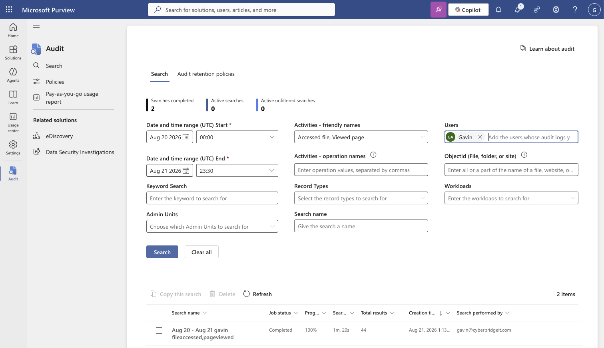
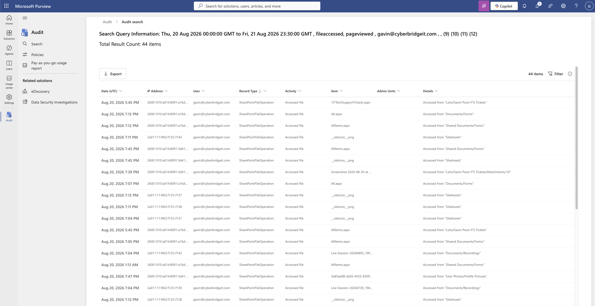
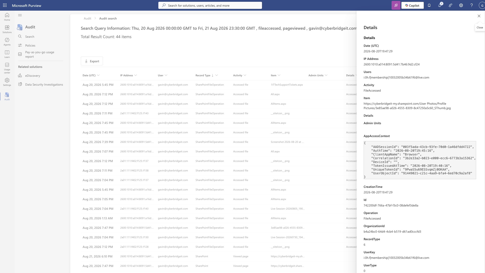
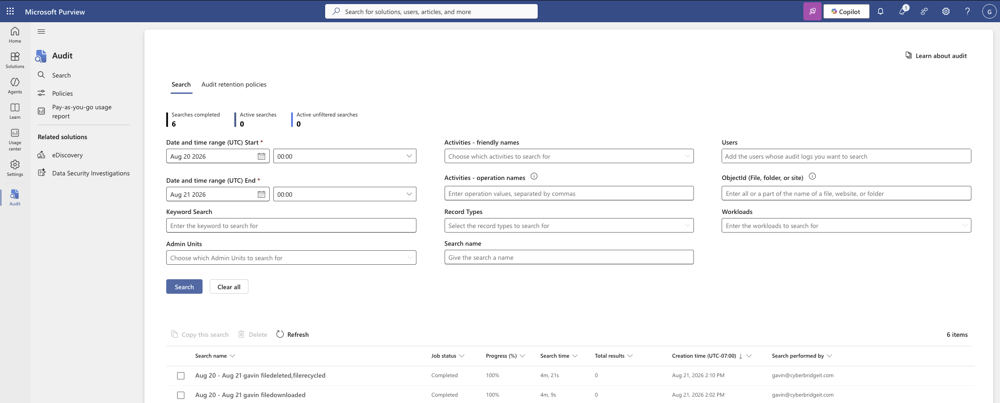
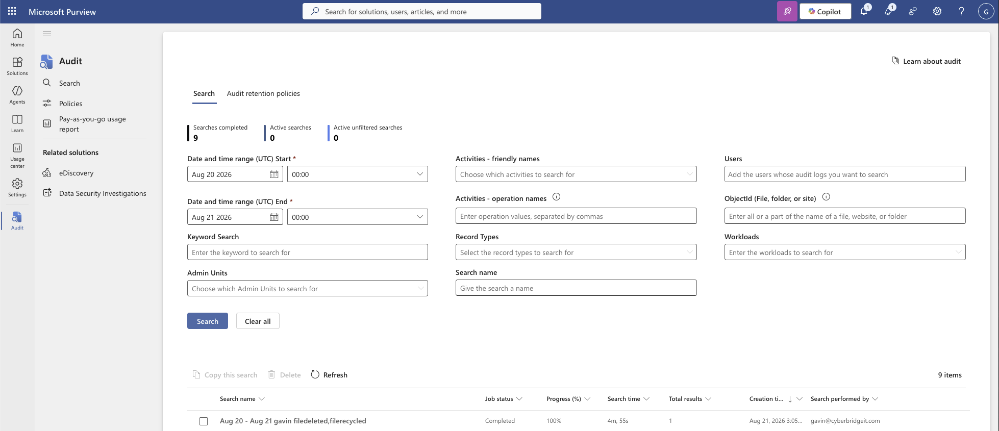
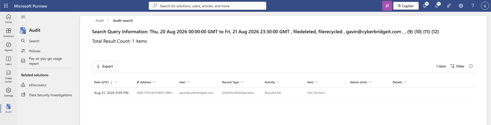

# File Activity Audit Investigation

> Status: Draft

## Scenario

Two authorized Microsoft 365 lab exercises used Microsoft Purview Audit to reconstruct file activity. The first reviewed which SharePoint files a user accessed. The second investigated a report that a file had “disappeared” and determined whether it had been deleted or moved to the recycle bin.

## Objectives

- Generate and locate SharePoint file-access events.
- Identify the user, item, timestamp, activity, and source IP.
- Reconstruct a user’s document activity.
- Generate and investigate a file-deletion event.
- Distinguish a recycled file from a permanently deleted file.
- Understand how audit-ingestion delays affect investigations.
- Correlate individual events into a defensible activity timeline.

## Environment

- Microsoft SharePoint Online
- Microsoft Purview Audit
- Dedicated organizational test account
- SharePoint document library
- File-access and deletion audit events

## Investigation Process

### 1. File-Access Activity Generation

Several files were opened and previewed in an authorized SharePoint document library. A Purview Audit search was then configured for the test user and the following activities:

- Accessed file
- Viewed page

Filtering for relevant activities reduced unrelated results and made it easier to focus on document-access behavior.

### 2. File-Access Evidence Review

The resulting audit records provided several useful fields:

- User
- Activity
- Item accessed
- Date and time
- Source IP address, when available
- Additional event details

Opening an individual event provided more context than the results list alone. The available fields could be used to build a timeline showing what the user accessed and when the activity occurred.

A single file-access event would not be enough to determine malicious intent. The item, timestamp, source IP, surrounding activity, user responsibilities, and expected behavior would need to be correlated before classifying the access as suspicious.

### 3. File-Deletion Activity Generation

A test document was created in SharePoint and then deleted. A Purview Audit search was configured for:

- Deleted file
- Recycled file

The initial search returned no results. After allowing additional ingestion time, the same search was run again and returned one event.

### 4. Deletion Event Analysis

The audit event showed that the file had been **recycled** rather than permanently deleted. The record included the affected item, initiating user, timestamp, activity, and source IP address.

This distinction was important because a user may describe a file as deleted or missing even when SharePoint has moved it to the recycle bin. The audit record provided evidence of what action actually occurred instead of relying only on the user’s description.

## Evidence Assessment

| Evidence | Investigative value |
|---|---|
| User | Identifies the account associated with the activity |
| Activity | Distinguishes access, page viewing, recycling, and deletion operations |
| Item | Identifies the file or resource involved |
| Timestamp | Supports event sequencing and timeline construction |
| Source IP | Provides network context when available |
| Recycled-file operation | Shows that the file was moved to the recycle bin rather than permanently removed |
| Initial zero-result search | Demonstrates that audit evidence may not be immediately available |

## Investigation Outcome

The file-access review demonstrated how Purview Audit can reconstruct a user’s interaction with SharePoint content. The deletion investigation confirmed that the test file had been recycled rather than permanently deleted.

The exercises also reinforced that audit events should be interpreted as part of a larger timeline. File access or deletion may be legitimate, accidental, or malicious depending on the user’s responsibilities, surrounding activity, and the sensitivity of the affected content.

## Operational Considerations

Audit-search delays can create uncertainty during time-sensitive investigations. An initial zero-result search should not automatically be interpreted as proof that the event was not logged.

Investigators should:

- Confirm that the search window and activity filters are correct.
- Allow for audit-data ingestion and search-processing time.
- Rerun the same search consistently.
- Review related activities before reaching a conclusion.
- Use additional telemetry when immediate containment decisions are required.

## Limitations

- All activity was intentionally generated in an authorized lab.
- The exercises used a small number of test files and events.
- Purview Audit did not provide real-time visibility.
- File-access events alone could not establish malicious intent.
- The investigation did not test permanent deletion or recycle-bin recovery.

## Security Concepts Demonstrated

- File-access auditing
- Audit-log investigation
- Insider-threat support
- Activity timeline reconstruction
- Evidence correlation
- Deletion-event analysis
- SharePoint recycle-bin awareness
- Audit-ingestion delay
- User-behavior analysis
- Incident validation

## Evidence

### File-Access Audit Search

The audit search targeted **Accessed file** and **Viewed page** activities for the selected test user and UTC date range. The completed search returned 44 results.

The results included timestamps, source IP addresses, users, record types, activities, items, and resource locations. The returned events included user-accessed content as well as supporting SharePoint resources such as forms, site assets, and page components.

This demonstrated why audit results must be filtered and interpreted rather than treating every returned event as a meaningful document-access incident.

### Event-Level Analysis

Opening an individual event exposed additional investigative fields, including:

* UTC event time
* Source IP address
* Actor identity
* Activity and operation
* Accessed item
* Client application
* Authentication context
* Correlation and session information

These fields can help reconstruct who accessed a resource, what was accessed, when the activity occurred, and which session or application was involved.

### Initial Recycled-File Search

The initial search for deleted-file and recycled-file activity completed successfully but returned zero results. A separate file-download search also returned zero results.

A completed search with no matches was not treated as proof that the action had not occurred. The activity had been generated recently, so audit-ingestion delay remained a likely explanation.

### Delayed Audit Result

After the search was repeated, the same deleted-file and recycled-file query returned one result. This confirmed that the original zero-result search reflected delayed event availability rather than the absence of the action.

The resulting event identified:

* Activity: **Recycled file**
* Item: `Test File.docx`
* User associated with the action
* UTC timestamp
* Source IP address
* SharePoint file-operation record type

The sequence demonstrated that investigators should account for Microsoft 365 audit latency, preserve the original search criteria, and repeat the search before concluding that expected activity was not logged.

Supporting screenshots for file access and recycled-file activity will be added next.
