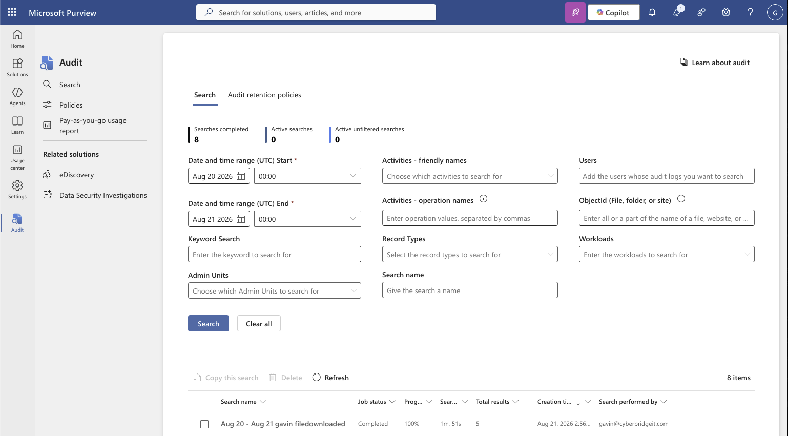
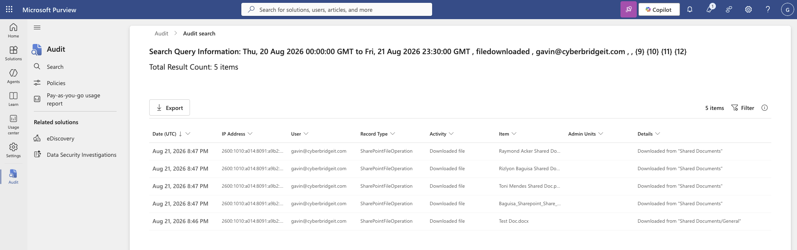
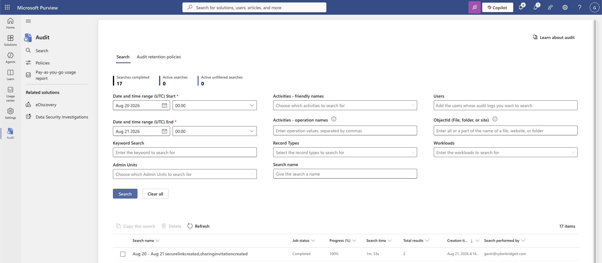
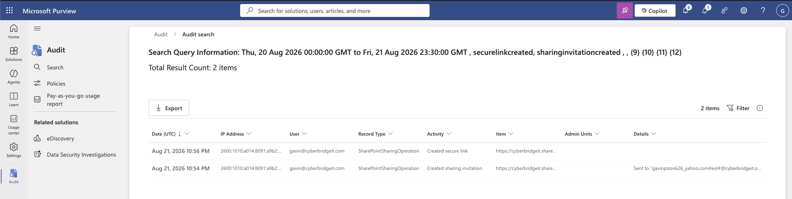

# Insider Risk Investigation

> Status: Draft

## Scenario

Authorized Microsoft 365 lab activity simulated two behaviors associated with potential insider risk: downloading multiple SharePoint files within a short period and sharing a payroll-themed test file outside the organization.

Microsoft Purview Audit was used to investigate the activity and determine which evidence could support an insider-threat or data-exfiltration investigation.

## Objectives

- Generate multiple file-download events within a short period.
- Identify clustered download activity in Purview Audit.
- Review the user, source IP, timestamp, activity, and downloaded items.
- Investigate the delay between user activity and audit visibility.
- Generate an external share involving a sensitive-looking test file.
- Correlate sharing invitations and secure-link creation.
- Build an evidence-based insider-risk assessment.

## Environment

- Microsoft SharePoint Online
- Microsoft Purview Audit
- Dedicated organizational and external test accounts
- SharePoint document library
- File-download and external-sharing audit events

## Investigation Process

### 1. Clustered File Downloads

Six SharePoint files were intentionally downloaded within a short time period. A Purview Audit search was then configured for the test user and relevant download activities.

The initial search completed with zero results. After allowing additional ingestion time, the same search was run again and returned five download events.

The results included:

- User
- Source IP address
- Activity
- Downloaded item
- Timestamp

The clustered timestamps were particularly important. Several downloads occurring close together may indicate bulk collection behavior, especially when the files are sensitive or the activity differs from the user’s normal baseline.

### 2. Download-Result Analysis

The lab generated six downloads, but the later audit search returned five matching events. This difference demonstrated that an audit search may not provide a complete one-to-one representation of every user action.

Possible factors requiring further investigation would include:

- Audit-data ingestion delay
- Search-window boundaries
- Activity-filter selection
- Duplicate or related operations
- Differences in how the client generated the download
- Additional events becoming available later

A production investigation should avoid assuming that the first returned result set is complete.

### 3. External Sharing of Sensitive-Looking Data

A payroll-themed test spreadsheet was uploaded to SharePoint and shared with an external account. A shareable link was also created.

The Purview Audit search returned two related events:

- Created sharing invitation
- Created secure link

The events included the external recipient, shared item, timestamp, source IP, initiating user, and sharing method.

Reviewing the events together provided a more complete picture than either event alone. One event documented the invitation to the external recipient, while the other documented creation of the sharing link.

### 4. Evidence Correlation

The clustered downloads and external sharing were reviewed as separate authorized simulations, but they represent behaviors that could become more significant when observed together in a production environment.

An analyst would need to determine:

- Whether the user normally accesses the affected files
- Whether the files contained sensitive information
- Whether the download volume was unusual
- Whether the external recipient was approved
- Whether the sharing method followed organizational policy
- Whether the activity occurred near a resignation or role change
- Whether additional uploads, downloads, deletions, or sign-ins occurred

## Insider-Risk Assessment

| Finding | Investigative significance |
|---|---|
| Multiple downloads occurred close together | May indicate bulk data collection |
| Initial search returned no events | Audit visibility was delayed |
| Five events appeared after six generated downloads | The returned audit set may not have been complete |
| Payroll-themed file was shared externally | Simulated exposure of sensitive organizational data |
| Sharing invitation and link creation produced separate events | Related operations must be correlated |
| User, item, recipient, IP, and timestamp were available | Supported timeline and attribution analysis |

## Assessment

**Disposition:** Simulated true positive — authorized insider-risk activity.

The generated behavior matched the exercise objectives and was not malicious. However, the same pattern in a production environment would warrant additional investigation because clustered downloads and external sharing can indicate unauthorized data collection or exfiltration.

The available evidence established which account performed the actions, which items were involved, and how the external access was created. It did not establish intent.

## Recommended Response

If similar activity occurred unexpectedly in production, appropriate actions could include:

- Preserving the relevant audit records.
- Confirming the activity with the user and manager.
- Reviewing the sensitivity and ownership of the affected files.
- Checking for additional downloads, shares, deletions, or unusual sign-ins.
- Removing unauthorized external access.
- Revoking active sessions if account misuse were suspected.
- Escalating to the security, legal, privacy, or human-resources teams when appropriate.

Containment decisions should be based on the sensitivity of the data, strength of the evidence, and risk of continued exposure.

## Limitations

- All activity was intentionally generated in an authorized lab.
- The files did not contain real payroll or proprietary information.
- Purview Audit results were delayed.
- The audit search returned five events after six downloads were generated.
- The exercises did not establish malicious intent.
- No automated alert or real-time containment control was tested.

## Security Concepts Demonstrated

- Insider-risk investigation
- Data-exfiltration indicators
- Bulk-download analysis
- External-sharing investigation
- Audit-log correlation
- Security-event timeline reconstruction
- Evidence preservation
- Incident triage
- Microsoft Purview Audit
- Containment decision-making

## Evidence

### Initial Download Search

The initial audit search for downloaded-file activity completed but returned zero results. Because the download activity had been generated recently, this was treated as a possible audit-ingestion delay rather than proof that no downloads occurred.

### Delayed Download Results

After the search was repeated, Purview returned five downloaded-file events. The difference between the two completed searches demonstrated that expected activity may become available after additional ingestion time.

The five downloads occurred within approximately one minute:

* One event was recorded at 8:46 PM UTC.
* Four events were recorded at 8:47 PM UTC.
* The events were associated with the same user and source IP address.
* Each event involved a different file.

The concentrated timing made the activity suitable for insider-risk review. However, clustered downloads alone do not establish malicious intent. Legitimate bulk work, synchronization, migration, or offline-access preparation can produce similar activity.

A production investigation would correlate the downloads with the user’s role, normal behavior, file sensitivity, device, destination, recent access changes, and subsequent sharing or transfer activity.

### External-Sharing Activity

The external-sharing search targeted secure-link creation and sharing-invitation activity. The completed query returned two results.

The results showed:

* A **Created sharing invitation** event at 10:54 PM UTC.
* A **Created secure link** event at 10:56 PM UTC.
* Both events were associated with the same user and source IP address.
* The sharing invitation identified an external destination.

These events confirmed that external-sharing mechanisms were created for the test resource. They did not, by themselves, prove that the external recipient opened the link or downloaded the file. Confirming successful data access would require correlation with file-access, secure-link-use, download, authentication, and recipient activity.

### Evidence Assessment

The combined evidence established an intentionally generated sequence of clustered downloads followed by external-sharing activity. In a production environment, this combination would warrant investigation because it could indicate collection and attempted transfer of organizational data.

**Disposition:** Simulated true positive — authorized insider-risk behavior with no conclusion of real compromise or confirmed exfiltration.

Supporting screenshots for clustered downloads and external sharing of the payroll-themed test file will be added next.
